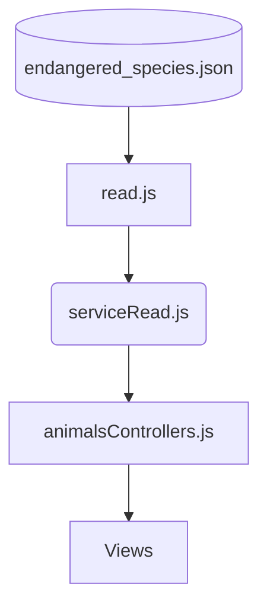

# KnowingTheOcean - Conoce el mundo submarino

Es un proyecto basado en una app web con la finalidad de sumergirse en las profundidades del océano sin viajar, ni mojarse, con el objetivo de echar un vistazo al mundo acuático y en especial a las especies marinas que necesitan especial atención debido a que se encuentran en peligro de extinción en mayor causa por las acciones inconvenientes del hombre.

**Problematica**

**Solución**

El conocer estas especies y saber la ayuda que necesitan para no desaparecer de la tierra para siempre, sería el primer paso para motivar a las personas a preocuparse por estos seres vivos con los que compartimos la vida en el planeta.

Mediante el uso de tecnologías como HTML, CSS y Javascript se crea una aplicación web, tipo “pokedex” para conocer a los animales marinos que se encuentran en peligro de extinción, lo que incluye: la población restante de su especie, hábitat, familia a la que pertenecen, entre otras cosas como la causa de su extinción.

**Diagrama de solución**



**Tecnologias utilizadas**
```
npm init -y  
```
```
npm install express --save  
```
```
npm install jest  
```


|`José Aleixs Chávez Galeas`|@AlexisChavezG|(launchx10528@innovaccion.mx)|
|`PR`|2|[Link al repo](https://github.com/LaunchX-InnovaccionVirtual/MissionNodeJS)|
|`Code Challenge`|3, 4, 5|[Link al repo](https://github.com/LaunchX-InnovaccionVirtual/MissionNodeJS)|
|`Trello`|6|[Link al repo](https://github.com/LaunchX-InnovaccionVirtual/MissionNodeJS)|
|`Trello JS Fork`|7|[Link al repo](https://github.com/LaunchX-InnovaccionVirtual/MissionNodeJS)|
